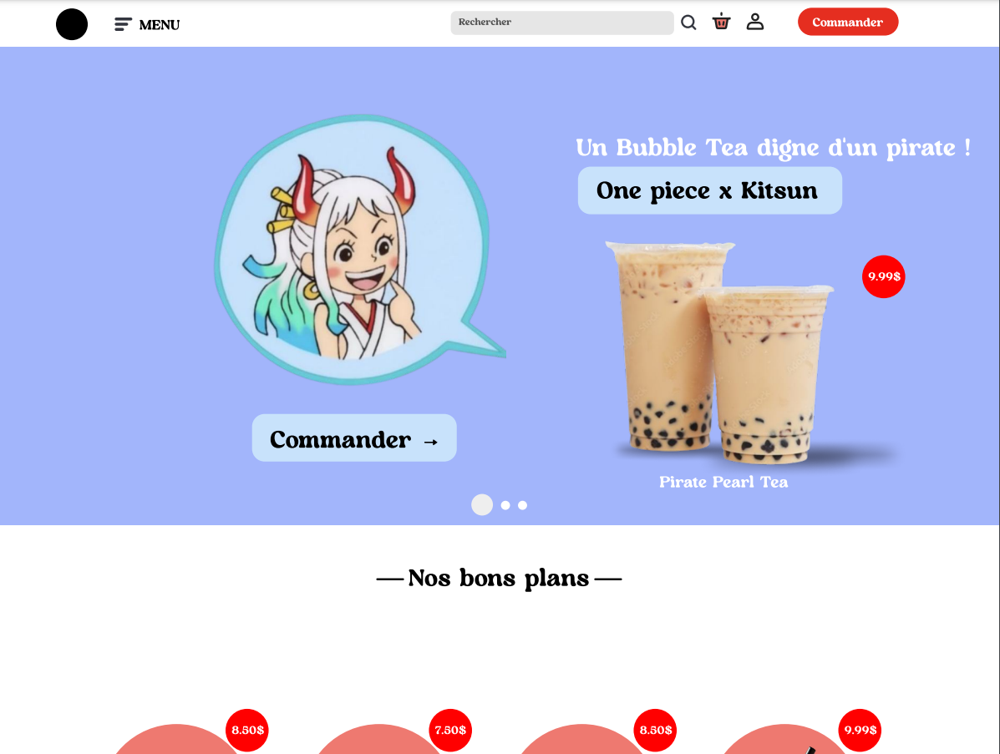
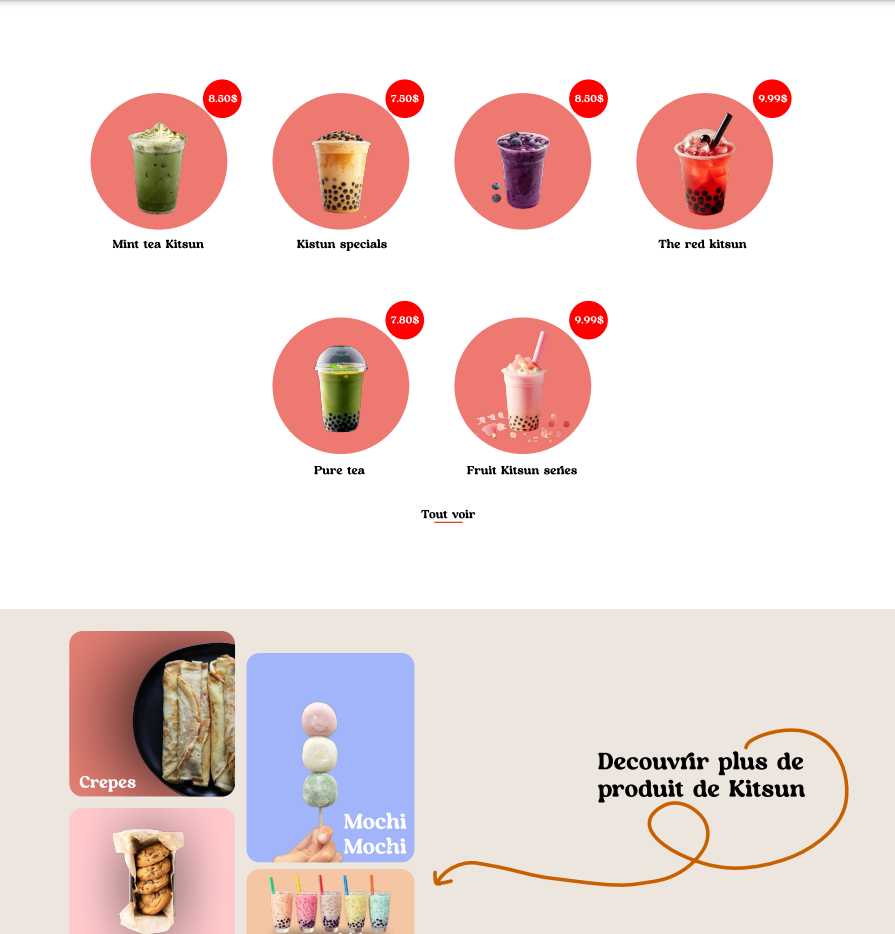

# Kitsun 🦊

Bienvenue à **Kitsun**, où chaque gorgée de Bubble Tea est une invitation au voyage, un hommage à la culture japonaise et à la gourmandise. Inspirés par le célèbre renard mystique des légendes japonaises, nous avons créé Kitsun pour partager avec vous notre passion pour les saveurs authentiques et l'art de la mixologie.

---

### 🌱ᆞ **Ingrédients naturels et de qualité**

Chez Kitsun, chaque boisson est élaborée à partir d'ingrédients soigneusement sélectionnés, en privilégiant le naturel et le local dans la mesure du possible. Nous travaillons avec des thés de première qualité, des fruits frais et des perles de tapioca d'origine contrôlée pour garantir un **Bubble Tea** aussi savoureux qu'authentique. La qualité et la fraîcheur sont au cœur de notre démarche.

---

### Nos Spécialités

#### 🍡 **Nos douceurs japonaises**

Découvrez nos spécialités sucrées qui complètent l'expérience Kitsun :

-   **Mochi artisanal** : une touche de douceur et d'authenticité !
-   **Crêpes japonaises** : moelleuses et généreuses.
-   **Biscuits japonais** : parfaits pour une pause gourmande.

#### 🍵ᆞ **Bubble Tea & Anime**

Kitsun est bien plus qu'un simple **Bubble Tea**. Grâce à nos partenariats exclusifs avec des franchises d'anime emblématiques comme _One Piece_, nous proposons des boissons et des expériences inspirées par les personnages et les mondes que vous aimez. Chaque mois, découvrez de nouvelles éditions spéciales et des créations exclusives qui rendent hommage à vos héros préférés !

---

### Contributeurs

-   Keyla Tiabas Houlai
-   Youness Eddabachi
-   John Perez Sanchez
-   Emmanuel Kouassi
-   Nolan Veopraseuth

---

### Lien vers le projet hébergé

[Accédez au projet sur GitHub](https://github.com/Keddaaa/Kitsun)

## Identifiants de Connexion pour Test

**Par Email :**
`jean.dupont@gmail.com`

**Mot de Passe :**
`123456`

### Notes importantes :

-   Ces identifiants sont fournis uniquement pour un usage de test ou de démonstration.
-   **Ne pas utiliser ces informations pour un environnement en production.**

---

## Conduite de projet

### Introduction

Dans le cadre de notre projet de gestion, nous avons été sollicités pour réaliser la conception du site web du restaurant **Kitsun**, spécialisé dans les **Bubble Tea**. L'objectif principal de cette refonte est de rendre le site plus attrayant, moderne, et d'améliorer l'expérience utilisateur, notamment en facilitant l'accès aux informations sur le menu et en offrant une meilleure compatibilité avec les appareils mobiles.

### Objectifs du projet

L'objectif est de créer un site web moderne et fonctionnel qui réponde aux besoins du client. Ce site devra permettre aux utilisateurs de consulter les produits proposés par le restaurant et éventuellement de passer des commandes en ligne. L’interface devra être intuitive, accessible sur tout type d’appareil, et refléter l’identité visuelle du restaurant.

---

### Définition des Sprints

Les fonctionnalités du projet **Kitsun** sont regroupées en sprints afin de favoriser une mise en œuvre progressive et collaborative. Voici la répartition des sprints :

| **Sprint** | **Objectif**                                                     |
| ---------- | ---------------------------------------------------------------- |
| Sprint 1   | Gestion des clients : Inscription, connexion, gestion du panier. |
| Sprint 2   | Présentation du site : Page d’accueil, recherche et navigation.  |
| Sprint 3   | Système Feedback : Formulaire d’avis, analyse des retours.       |
| Sprint 4   | Galerie photo : Ajout, modification, suppression des photos.     |

---

## Conduite de projet - User Stories et Backlog

Pour chaque sprint, les **User Stories** sont définies afin de refléter les besoins des utilisateurs finaux. Voici un exemple de backlog par sprint :

### Gestion des clients

| **ID** | **User Story**                                                        | **Tâches**                                            | **Priorité** | **Critères d'acceptation**                                                                                                    | **Etat** |
| ------ | --------------------------------------------------------------------- | ----------------------------------------------------- | ------------ | ----------------------------------------------------------------------------------------------------------------------------- | -------- |
| US1    | En tant qu'utilisateur, je veux m'inscrire pour accéder à mon panier. | Créer un formulaire d'inscription.                    | 1            | Le formulaire valide les données utilisateur et affiche un message de confirmation.                                           | Fini     |
| US2    | En tant qu'utilisateur, je veux consulter et modifier mon panier.     | Intégrer la fonctionnalité de gestion du panier.      | 1            | Les utilisateurs peuvent ajouter, modifier ou supprimer des articles dans le panier et voir le total actualisé en temps réel. | Fini     |
| US3    | En tant qu'utilisateur, je veux valider ma commande en ligne.         | Ajouter une fonctionnalité de validation de commande. | 2            | Une confirmation de commande est envoyée par e-mail une fois validée.                                                         | À faire  |

---

| **ID** | **User Story**                                                               | **Tâches**                                           | **Priorité** | **Critères d'acceptation**                                                                                                | **Etat** |
| ------ | ---------------------------------------------------------------------------- | ---------------------------------------------------- | ------------ | ------------------------------------------------------------------------------------------------------------------------- | -------- |
| US1    | En tant qu'utilisateur, je veux voir les produits récents en page d'accueil. | Créer une page d'accueil dynamique.                  | 1            | Les produits les plus récents sont affichés avec des images attrayantes et un lien direct vers leur page détail.          | Fini     |
| US2    | En tant qu'utilisateur, je veux rechercher rapidement un produit.            | Ajouter une barre de recherche avec fonction de tri. | 1            | La recherche renvoie des résultats pertinents en fonction des mots-clés ou des filtres appliqués (catégorie, prix, etc.). | Fini     |

### Système Feedback

| **ID** | **User Story**                                                                   | **Tâches**                                            | **Priorité** | **Critères d'acceptation**                                                                        | **Etat** |
| ------ | -------------------------------------------------------------------------------- | ----------------------------------------------------- | ------------ | ------------------------------------------------------------------------------------------------- | -------- |
| US1    | En tant qu'utilisateur, je veux laisser un avis sur les produits ou services.    | Créer un formulaire d'avis utilisateur.               | 1            | Les avis sont enregistrés dans la base de données et s'affichent dans un module de retour client. | En cours |
| US2    | En tant qu'administrateur, je veux consulter les retours pour améliorer l'offre. | Intégrer un tableau de bord pour les retours clients. | 2            | Les retours clients sont classés par produit et analysables via des graphiques.                   | En cours |

---

### Galerie Photo

| **ID** | **User Story**                                                                | **Tâches**                                              | **Priorité** | **Critères d'acceptation**                                                                          | **Etat** |
| ------ | ----------------------------------------------------------------------------- | ------------------------------------------------------- | ------------ | --------------------------------------------------------------------------------------------------- | -------- |
| US1    | En tant qu'utilisateur, je veux voir des photos des produits.                 | Créer une galerie photo avec albums.                    | 1            | Les photos s'affichent sous forme de grille avec la possibilité de naviguer par album.              | Fini     |
| US2    | En tant qu'administrateur, je veux ajouter, modifier ou supprimer des photos. | Ajouter une interface d’administration pour la galerie. | 2            | Les modifications effectuées dans l’administration sont immédiatement reflétées sur le site public. | Fini     |

---

## Planification et Réalisation des Sprints

### Planification

-   Organiser une réunion pour estimer les efforts (en points ou heures) pour chaque User Story.
-   Identifier les priorités et définir le contenu du sprint.

### Exécution

-   Déplacer les tâches du backlog à "En cours" lors du démarrage.
-   Utiliser des outils comme Trello ou Jira pour suivre l'avancement.
-   Organiser des "Daily Scrums" (15 minutes) pour faire le point sur l’avancement.

### Outils de collaboration

-   Trello ou Jira pour la gestion des tâches.
-   Discord pour la communication rapide.
-   Figma pour les maquettes et designs.

### Validation Croisée et Rétrospective

-   Validation croisée : Les groupes s'évaluent mutuellement sur les critères d'acceptation.
-   Rétrospective : Identifier ce qui a bien fonctionné et les axes d’amélioration. Documenter les apprentissages pour le prochain sprint.

---

### Répartition des tâches

#### Sprint 1 : Gestion des clients

-   Création du formulaire d'inscription (US1)

    -   Responsable : Keyla
    -   Raisons : Connaissance des formulaires et des validations.

-   Intégration de la gestion du panier (US2)

    -   Responsable : Nolan
    -   Raisons : Expérience dans la gestion d'éléments dynamiques en JavaScript.

-   Ajout de la fonctionnalité de validation de commande (US3)
-   Responsable : Emmanuel
-   Raisons : Intérêt pour les bases de données et l'intégration backend.

### Sprint 2 : Présentation du site

-   **Création de la page d'accueil dynamique (US1)**

    -   **Responsable** : John
    -   **Raisons** : Sens du design et des interactions utilisateurs.

-   **Ajout d'une barre de recherche et des fonctions de tri (US2)**
    -   **Responsable** : Youness
    -   **Raisons** : Capacité à implémenter des fonctionnalités complexes.

---

### Sprint 3 : Système Feedback

-   **Création du formulaire d'avis utilisateur (US1)**

    -   **Responsable** : Keyla
    -   **Raisons** : Expertise dans les interfaces intuitives.

-   **Intégration du tableau de bord pour les retours clients (US2)**
    -   **Responsable** : Nolan
    -   **Raisons** : Compétence en visualisation de données et dashboards.

---

### Sprint 4 : Galerie photo

-   **Création de la galerie photo avec albums (US1)**

    -   **Responsable** : John
    -   **Raisons** : Créativité et sens artistique.

-   **Ajout de l'interface d'administration pour la galerie (US2)**
    -   **Responsable** : Youness
    -   **Raisons** : Expérience dans les outils administratifs et leur sécurisation.

### Planification et Gestion

**Scrum Master**

-   **Responsable** : Emmanuel
-   **Raisons** : Bonne organisation et gestion des priorités.

**Suivi des tâches (Trello/Jira)**

-   **Responsables** : Keyla et Nolan (support).

**Design et Maquettes (Figma)**

-   **Responsable** : John.

**Communication (Discord)**

-   **Responsable** : Youness (modérateur principal).

### Étapes principales :

#### 1. Idéation et conception

Cette étape est fondamentale pour poser les bases solides du projet et garantir que l'équipe travaille en harmonie avec les attentes du client.

-   **Analyse des besoins**
    L'équipe commence par collecter toutes les informations pertinentes sur le restaurant Kitsun : son identité visuelle, ses valeurs, ses produits phares (notamment les bubble teas), et les fonctionnalités attendues pour le site web. Cette phase implique :

    -   Entrevues avec le client : Pour comprendre leurs objectifs, leur vision, et leurs contraintes.
    -   Analyse des utilisateurs finaux : Identification des profils types (personas) des utilisateurs cibles et définition de leurs besoins principaux, tels que la facilité de navigation ou l'accès rapide au menu.
    -   Analyse concurrentielle : Étudier les sites similaires pour déterminer les bonnes pratiques et identifier des opportunités d'innovation.

-   **Définition des objectifs**
    À partir des données collectées, l'équipe établit des objectifs clairs et mesurables pour le site web. Par exemple :

    -   Augmenter la visibilité en ligne de Kitsun.
    -   Simplifier la navigation pour améliorer l'expérience utilisateur.
    -   Permettre une éventuelle commande en ligne et gérer les avis clients.

-   **Brainstorming et idéation**
    Une session de brainstorming est organisée pour générer des idées créatives et innovantes. L'équipe discute des solutions techniques et des approches visuelles les plus adaptées. Les meilleures idées sont retenues et organisées dans un plan fonctionnel.

-   **Création des maquettes**
    Une fois les idées validées, des maquettes détaillées sont créées à l'aide d'outils comme Figma. Cette phase inclut :

    -   Le design des pages principales (accueil, menu, galerie, contact).
    -   Une structure UX (expérience utilisateur) intuitive, avec une navigation claire et rapide.
    -   L'utilisation des couleurs, polices, et éléments graphiques reflétant l'identité visuelle de Kitsun.

-   **Validation des maquettes**
    Les maquettes sont partagées avec le client pour retour. Une phase de révision est prévue pour ajuster les éléments selon leurs commentaires. Cette validation assure que l'équipe démarre le
