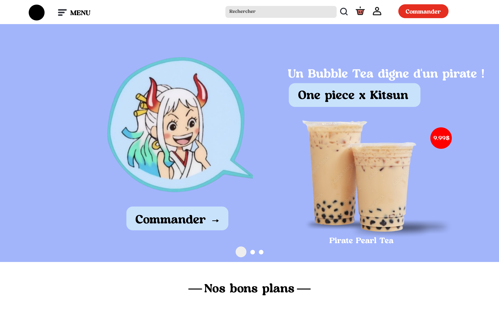

# Kitsun 🦊

Bienvenue à **Kitsun**, où chaque gorgée de Bubble Tea est une invitation au voyage, un hommage à la culture japonaise et à la gourmandise. Inspirés par le célèbre renard mystique des légendes japonaises, nous avons créé Kitsun pour partager avec vous notre passion pour les saveurs authentiques et l'art de la mixologie.

---

### 🌱ᆞ **Ingrédients naturels et de qualité**

Chez Kitsun, chaque boisson est élaborée à partir d'ingrédients soigneusement sélectionnés, en privilégiant le naturel et le local dans la mesure du possible. Nous travaillons avec des thés de première qualité, des fruits frais et des perles de tapioca d'origine contrôlée pour garantir un **Bubble Tea** aussi savoureux qu'authentique. La qualité et la fraîcheur sont au cœur de notre démarche.

---

### Nos Spécialités

#### 🍡 **Nos douceurs japonaises**

Découvrez nos spécialités sucrées qui complètent l'expérience Kitsun :

-   **Mochi artisanal** : une touche de douceur et d'authenticité !
-   **Crêpes japonaises** : moelleuses et généreuses.
-   **Biscuits japonais** : parfaits pour une pause gourmande.

#### 🍵ᆞ **Bubble Tea & Anime**

Kitsun est bien plus qu'un simple **Bubble Tea**. Grâce à nos partenariats exclusifs avec des franchises d'anime emblématiques comme _One Piece_, nous proposons des boissons et des expériences inspirées par les personnages et les mondes que vous aimez. Chaque mois, découvrez de nouvelles éditions spéciales et des créations exclusives qui rendent hommage à vos héros préférés !

---

### Contributeurs

-   Keyla Tiabas Houlai
-   Youness Eddabachi
-   John Perez Sanchez
-   Emmanuel Kouassi
-   Nolan Veopraseuth

---

### Lien vers le projet hébergé

[Accédez au projet sur GitHub](https://github.com/Keddaaa/Kitsun)

### See ya at Kitsun!

Ready to experience Kitsun? Whether you're a fan of One Piece or simply curious about our creations, drop in or order online for a unique taste journey. We can't wait to share with you the best of Bubble Tea, Japanese sweets, and exclusive collaborations inspired by your favorite anime! 🦊✨
